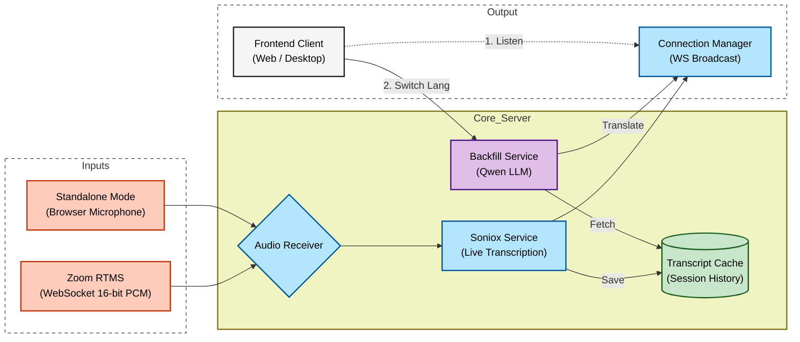

# CALC Translation

[**Desktop App**](https://github.com/jcarpenter-uam/calc-translation-desktop) | [**Deployment Guide**](./HOW-TO.md)

## About This Project
This project is a comprehensive real-time transcription and translation platform designed to bridge communication gaps in meetings. Unlike traditional bots, it integrates directly with data streams to provide low-latency, accurate captions in multiple languages.

## Features

* **Dual Operation Modes:**
    * **Zoom Integration:** Connects seamlessly via Zoom RTMS (Real-time Media Stream) to capture high-quality meeting audio without a "ghost" participant.
    * **Standalone Mode:** Allows hosts to stream audio directly from their local microphone, making it perfect for in-person presentations or non-Zoom calls.
* **Smart Backfill:** Utilizing Alibaba's Qwen LLM, the system instantly translates the entire session history when a user joins late or switches their target language, ensuring no context is lost.
* **AI Summaries:** Using the meeting transcript a meeting summary is emailed to each meeting attendee at the end of a meeting.
* **Calendar Sync:** Integrates with Microsoft 365 to automatically fetch upcoming meetings and generate one-click join links.

## How It Works

