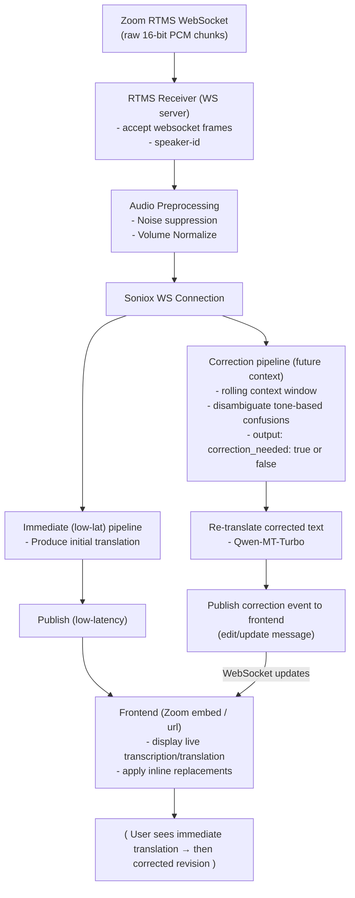

# Zoom Real-time Translation

## About This Project

This project develops a real-time translation pipeline that integrates directly with Zoom meetings using its RTMS functionality. It captures live audio and processes it through an automated workflow that transcribes, translates, and corrects the content in real time. The final output is displayed on an intuitive frontend where visual indicators clearly highlight any corrections, ensuring participants can follow the conversation accurately and seamlessly.

## How It Works



## Prerequisites

- **Ollama:** Used to handle the text correction logic. To enable this feature, you must train a model using the colab notebook and dataset [here](https://github.com/jcarpenter-uam/zoom-translation/tree/master/extras/ollama/correction)
- **Soniox:** Used as the current transcription/translation model. An API key can be obtained [here](https://soniox.com/docs/)
- **Qwen-MT-Turbo:** Used as the current retranslation model. An API key can be obtained [here](https://www.alibabacloud.com/help/en/model-studio/stream)

## Installation

**Docker Compose**

```bash
services:
  zoom-translation-server:
    build: ./zoom-translation-server
    pull_policy: build
    container_name: zoom-translation-server
    restart: unless-stopped
    ports:
      - "8000:8000"
    environment:
      - SONIOX_API_KEY=${SONIOX_API_KEY}
      - ALIBABA_API_KEY=${ALIBABA_API_KEY}
      - OLLAMA_URL=${OLLAMA_URL}
      - DEBUG_MODE=${DEBUG_MODE}
    networks:
      - zoom-translation

  zoom-rtms-server:
    build: ./zoom-rtms-server
    pull_policy: build
    container_name: zoom-rtms-server
    restart: unless-stopped
    ports:
      - "8080:8080"
    environment:
      - ZM_RTMS_CLIENT=${ZM_RTMS_CLIENT}
      - ZM_RTMS_SECRET=${ZM_RTMS_SECRET}
      - ZOOM_WEBHOOK_SECRET_TOKEN=${ZOOM_WEBHOOK_SECRET_TOKEN}
      - ZOOM_TRANSLATION_SERVER_URL=${ZOOM_TRANSLATION_SERVER_URL}
    depends_on:
      - zoom-translation-server
    networks:
      - zoom-translation

networks:
  zoom-translation:
    driver: bridge
```

**Expected Variables**

```bash
ZM_RTMS_CLIENT=
ZM_RTMS_SECRET=
ZOOM_WEBHOOK_SECRET_TOKEN=

ZOOM_TRANSLATION_SERVER_URL="ws://zoom-translation-server:8000/ws/transcribe"

# Soniox API
SONIOX_API_KEY=

# QWEN-MT-Turbo Retranslation
ALIBABA_API_KEY=

#Ollama
OLLAMA_URL="http://localhost:11434"

# Determines wether or not audio files and log files are saved per session
DEBUG_MODE=False # True/False as options
```

## Todo:

- Change cache size limit to be MB/GB based, not length
- Skip correction model for EN -> ZH

## Inprovements:

- Denoising and Normalizing audio needs improvements. Though for zoom calls a simple noise floor should do the trick
- IaC for datacrunch GPU server based on zoom meeting calender?
- Send final transcript to all meeting participants
- Auto fine tuning?
