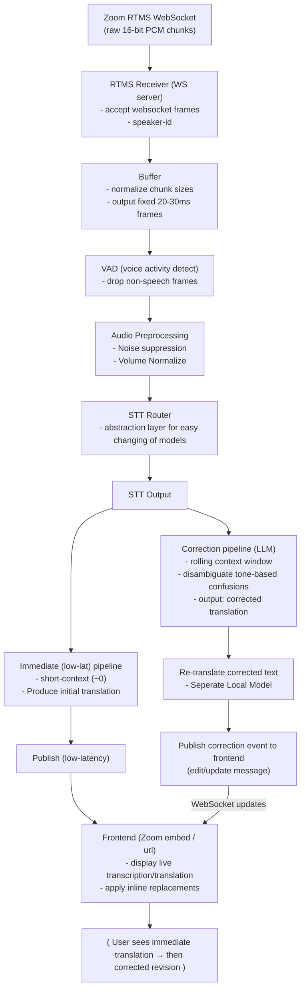

# Zoom Real-time Translation

## About This Project

This project develops a real-time translation pipeline that integrates directly with Zoom meetings using its RTMS functionality. It captures live audio and processes it through an automated workflow that transcribes, translates, and corrects the content in real time. The final output is displayed on an intuitive frontend where visual indicators clearly highlight any corrections, ensuring participants can follow the conversation accurately and seamlessly.

## How It Works



## Prerequisites

- **Ollama:** Used to handle the text correction logic. To enable this feature, you must train a model using the colab notebook and dataset [here](https://github.com/jcarpenter-uam/zoom-translation/tree/master/extras/ollama/correction)
- **iFlyTech API Key:** Used as the current ASR (STT) model. The credentials can be gathered [here](https://global.xfyun.cn/doc/rtasr/rtasr/API.html#description-of-the-interface)
- **Alibaba:** Used as the current translation model. An API key can be obtained [here](https://www.alibabacloud.com/help/en/model-studio/stream)

## Installation

**1. Create your .env**

```bash
cp .env.example .env
```

**2. Run the Server**

```bash
docker compose up -d
```

## Todo:

- auto select translation/transcription model based on which .env vars are present
- IaC for datacrunch GPU server based on zoom meeting calender?
- Send final transcript to all meeting participants
- Empty responses in frontend?
- Keep tweaking the fine tuned model to get the best results
- Play with cache size, we want full history but at what point is too long?
- Clean up seperation of concerns between files: logging, connection-manager, etc..
