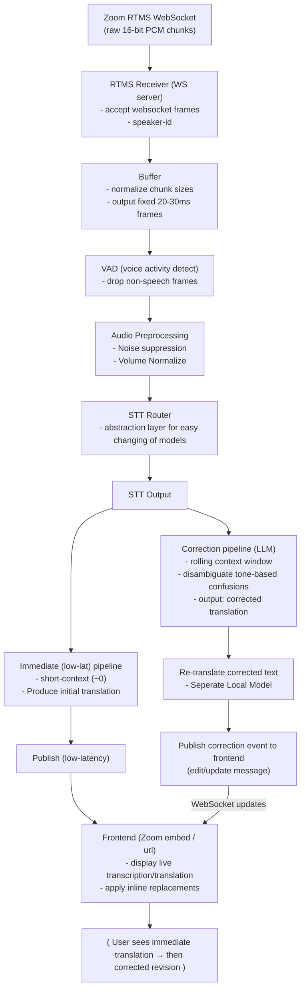

# Zoom Real-time Translation

## Todo:

- Better model, or system prompt to improve the correction pipeline
- Play with cache size, we want full history but at what point is too long?
- Clean up seperation of concerns between files: logging, connection-manager, etc..
- On session end, process the final utterances for correction before clearing cache and saving .json file
- Serve frontend build files from backend, take into account zoom security headers
