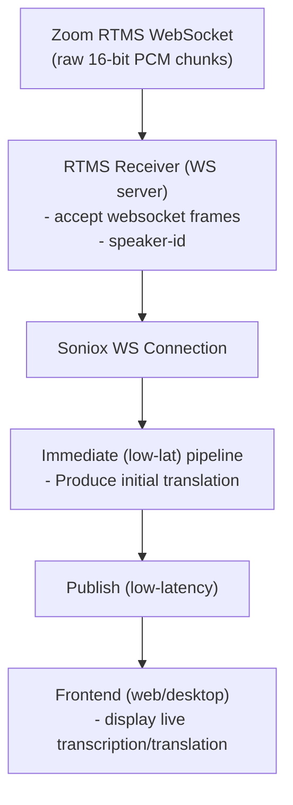

# CALC Translation

[Checkout the Desktop App](https://github.com/jcarpenter-uam/calc-translation-desktop)

## About This Project

This project develops a real-time translation pipeline that integrates directly with Zoom meetings using its RTMS functionality. It captures live audio and processes it through an automated workflow that transcribes and translates the content in real time. The final output is displayed on an intuitive frontend, ensuring participants can follow the conversation accurately and seamlessly.

## How It Works

